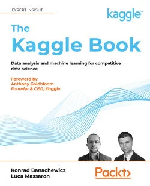
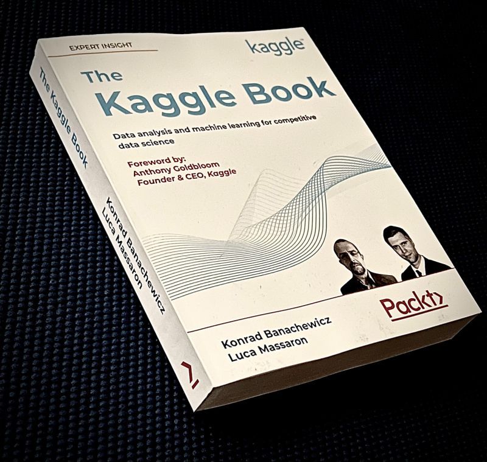
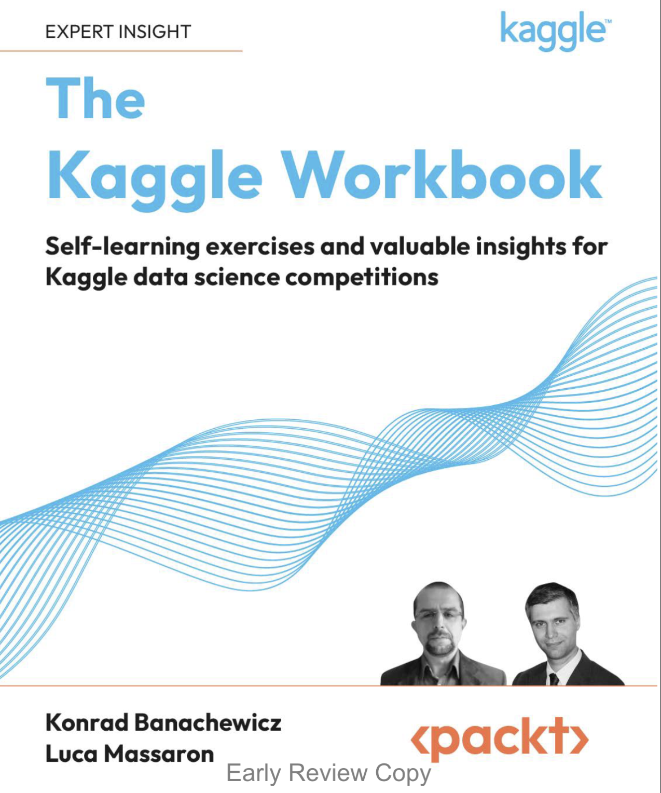

# The Kaggle Workbook - Review

:tada: The Kaggle Workbook (**TKWB**: 2023) is the well deserved organic sequel of the The Kaggle Book (**TKB**: 2022), by *Konrad Banachewicz* and *Luca Massaron*. Fortunately, in 2022, I also had the opportunity to receive a review copy of the The Kaggle Book, from Packt.

|    |  |
|:---:|:---:|
| The Kaggle Book :one: | **The Kaggle Workbook** :two: :star: |

:bulb: If you have not purchased the predecessor, The Kaggle Book yet, and you are wondering how to get started with Data Science competitions on Kaggle.com, it will certainly give you a strategic boost to see Kaggle from the perspective of the Kaggle Grandmasters.

:butterfly: While **TKB** acts as the introduction to the mindset of a Kaggler from a rather wholistic point of view, helping new Kagglers aligning with a certain perspective necessary for Kaggle-success, The Kaggle Workbook (**TKWB**), brings in a balanced glimpse into how successful Kagglers would approach specific problems.

:point_right: *Think of **TKB** as the course work and **TKWB** as the hands-on lab-work*.

## :gift: **The Kaggle Workbook** -- *What's in it?*

**Authors**: :man::woman:

This time Konrad and Luca have joined hands with three more successful and accomplished Kagglers -- *Pietro*, *Laura* and *Gabriel*.

- Konrad Banachewicz
- Luca Massaron
- Pietro Marinelli
- Laura Fink
- Gabriel Preda

**Chapters Overview**: :eye:

The Kaggle Workbook (TKWB), offers hands-on knowledge through a meticulously dissected review of 4 popular Kaggle Competitions covering **Tabular Dataset** (chapter-1), **Time Series Dataset** (chapter-2), **Computer Vision Dataset** (chapter-3) and **NLP Dataset** (chapter-4), spanning over ~150 pages.

- **Chapter 1**:
  *The Most Renowned Tabular Competition – Porto Seguro’s Safe Driver Prediction*
- **Chapter 2**:
  *The Makridakis Competitions – M5 on Kaggle for Accuracy and Uncertainty*
- **Chapter 3**:
  *Vision Competition: Cassava Leaf Disease Competition*
- **Chapter 4**:
  *NLP Competition – Google Quest Q&A Labeling*

**Value Addition**: :moneybag: 📈

:gift: The authors' perspective, tactics and insight into previously successful top-ranking Kaggle solutions of these Kaggle Challenges also presents an impeccably important perspective for todays' Data Scientists -- *learn how to learn*.

:bulb: Studying existing Kaggle solutions, documentation of libraries and source-code of the same libraries on GitHub/GitLab, could give you the much needed access to resources and good learning opportunity. Unfortunately, for many, this profound resource of knowledge and method of learning either appears too amorphous or remains hidden in plain-sight.

> The Kaggle Workbook, quite aptly puts the focus right on the bulls eye -- *learn from the examples, best solutions, existing source-code, etc*.

:point_right: I hope, whether you are a new Kaggler, Data Science enthusiast, seasoned Kaggler or seasoned Data Scientist, **TKWB** will serve everyone, as a quaint reminder of the pleasure of hardwork-driven excellence and the ubiquitous joy in the rather piquant flavours of learning.

:sparkles: Wishing you Happy Kaggling!

*A special thanks to Packt for sending me the review copy of the book and Kudos to the authors of the book.*

## :fire: **Should you buy it?**

If you are serious about learning Data Science, and not just keeping the book on your shelf to "share" photos of your Data Science / ML / AI books, then **YES**. You will learn a few things certainly. Please be respectful of the fact that writing a book takes a lot of effort and time. These Kagglers are also well-respected Data Science professionals. If the book helps you, share about it. Let's learn together.

:balloon: The fact that you get a glimpse of how advanced Kagglers approach Kaggle competitions, is a priviledge, at the very least. Hope you will make good use of it. :rocket:

## :books: **References**

- `[1]` The Kaggle Book (TKB): ([Amazon][_tkb_amazon], [Packt][_tkb_packt])
- `[2]` The Kaggle Workbook (TKWB): ([Amazon][_tkwb_amazon], [Packt][_tkwb_packt])

Social Media Posts:

- LinkedIn posts on TKB [[3]][_tkb_lnkd_1], [[4]][_tkb_lnkd_2].
- LinkedIn post on TKWB [[5]][_tkwb_lnkd] book review.
- Substack Post on TKWB [[6]][_tkwb_substack] book review.

[_tkwb_substack]: https://sugatoray.substack.com/p/the-kaggle-workbook-review

[_tkb_lnkd_1]: https://www.linkedin.com/posts/sugatoray_the-kaggle-book-data-analysis-and-machine-activity-6922632295904411648-1-ep?utm_source=share&utm_medium=member_desktop

[_tkb_lnkd_2]: https://www.linkedin.com/posts/sugatoray_packt-kaggle-book-activity-6964339052904943616-tsci?utm_source=share&utm_medium=member_desktop

[_tkwb_lnkd]: https://www.linkedin.com/posts/sugatoray_the-kaggle-workbook-review-activity-7037268153231446017-LNxd?utm_source=share&utm_medium=member_desktop

[_tkb_amazon]: https://www.amazon.com/Data-Analysis-Machine-Learning-Kaggle/dp/1801817472/

[_tkb_packt]: https://www.packtpub.com/product/the-kaggle-book/9781801817479

[_tkwb_amazon]: https://www.amazon.com/Kaggle-Workbook-Self-learning-exercises-competitions/dp/1804611212/ref=sr_1_1?crid=TLSYEIN4NY0J&keywords=the+kaggle+workbook&qid=1677808859&sprefix=the+kaggle+workbook%2Caps%2C97&sr=8-1

[_tkwb_packt]: https://www.packtpub.com/product/the-kaggle-workbook/9781804611210

---

Copyright &copy; Sugato Ray, 2023
